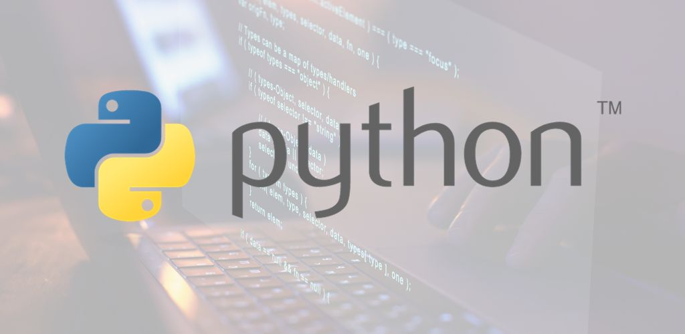

# Repositorio de Ejercicios del Curso de Programación 3

## Datos Personales

**Nombre:** Gerardo Ali Ferraro Schelijasch  
**Email:** gerferr83@soltecferr.com  
**Teléfono:** +58 412-0794577  
**GitHub:** [stferraro](https://github.com/stferraro)
 

## Descripción

Este es el repositorio de ejercicios del curso de Programación 3. Aquí encontrarás todos los ejercicios y proyectos realizados durante el curso.

## Contenido

Unidad I - Conceptos básicos del lenguaje Python:

- Variables 
- Constantes 
- Tipos de datos
    - Numericos
        - Enteros
        - Decimales
    - Booleanos (True, False)
    - Strings (Cadenas de caracteres)
- Operadores:
    - Operadores aritmeticos 
        - (+ , - , * , / , **)
    - Operadores relacionales
        - (> , < , >=, == , <=)
    - Operadores logicos 
        - (and, or, not)
    - Operadores de incremento y decremento

